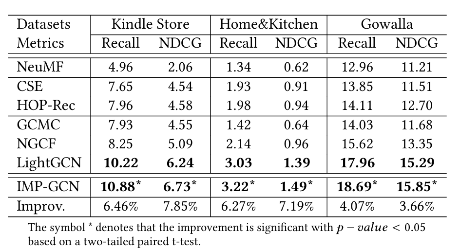

# `Interest-aware Message-Passing GCN for Recommendation`

> `IMP-GCN improves GCN-based recommendation by restricting high-order message passing to interest-consistent subgraphs, effectively alleviating over-smoothing and noisy propagation.`

## Authors

**Fan Liu**<sup>1</sup>, **Zhiyong Cheng**<sup>2</sup>\*, **Lei Zhu**<sup>3</sup>, **Zan Gao**<sup>2</sup>, **Liqiang Nie**<sup>1</sup>\*

<sup>1</sup> `Shandong University, China`  
<sup>2</sup> `Shandong Artificial Intelligence Institute, China`  
<sup>3</sup> `Shandong Normal University, China`  
\* Corresponding author

## Links

- **Paper**: [`Paper Link`](https://dl.acm.org/doi/abs/10.1145/3442381.3449986)
- **Code Repository**: [`GitHub`](https://github.com/iLearn-Lab/WWW21-IMPGCN)

---

## Updates

- [02/2021] Initial release
- [02/2021] Release paper / arXiv version
- [02/2021] Release code

---

## Introduction

本项目是论文 **`Interest-aware Message-Passing GCN for Recommendation`** 的官方实现。

请在这里简要说明：

- 论文要解决的问题
  - 现有基于 GCN 的推荐方法（如 NGCF、LightGCN）虽然能够利用高阶邻居信息提升表示能力，但存在过平滑（over-smoothing）问题：随着层数加深，不同用户的表示逐渐趋同，导致推荐性能下降。

- 方法的核心思想是什么：
  - 只利用“兴趣一致”的高阶邻居信息进行表示学习

- 与现有方法相比有什么特点：
  - 减少噪声传播
  - 缓解过平滑问题
  - 支持更深层模型  

- 本仓库提供了：
  - 训练代码
  - 训练集
  - 测试集

### Description

We present **IMP-GCN**, a framework for **collaborative filtering recommendation**.  
Our method addresses the **over-smoothing and noisy message propagation problem** by introducing an **interest-aware subgraph-based message passing mechanism**, restricting high-order propagation within groups of users sharing similar interests.  

---

## Highlights

- 支持 `<CF-based recommendation Task>`
- 提供 `<training / inference / evaluation>` 脚本
- 提供 `<dataset>`
- 适合用于 `<论文复现 / 后续研究>`

---

## Method / Framework

### Framework Figure

```markdown

```

**Figure 1.** Overall framework of `<Method Name>`.

---


## Usage

## Environment Settings
- Tensorflow-gpu version:  1.3.0

## Example to run the codes.

### Training

# gowalla
Run IMP_GCN.py
```
python IMP_GCN.py --dataset gowalla  --regs [1e-4] --embed_size 64 --layer_size [64,64,64,64,64,64] --lr 0.001 --batch_size 2048 --epoch 2000 --groups 3 --Ks [20,10] --gpu_id 0
```

### Example Results

你可以插入结果图：

```markdown

```

---

## Citation

```bibtex
@inproceedings{10.1145/3442381.3449986,
author = {Liu, Fan and Cheng, Zhiyong and Zhu, Lei and Gao, Zan and Nie, Liqiang},
title = {Interest-aware Message-Passing GCN for Recommendation},
year = {2021},
publisher = {ACM},
booktitle = {Proceedings of the Web Conference 2021},
pages = {1296–1305}
```

---

## Acknowledgement

- Thanks to our supervisor and collaborators for valuable support.
- Thanks to the open-source community for providing useful baselines and tools.

---

## License

This project is released under the Apache License 2.0.
